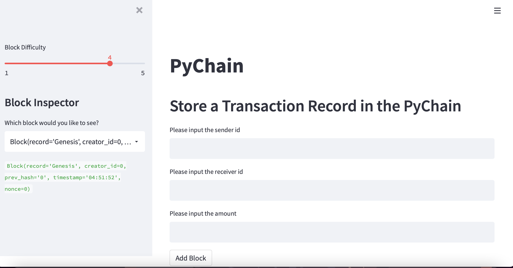

# Pychain

A sample blockchain-based ledger system, completed with a user-friendly web interface. This ledger should allow transfer money between senders and receivers and to verify the integrity of the data in the ledger.

## Technologies

* [Streamlit](https://streamlit.io/)

To install it run the following command line in the Terminal

    ```pip install streamlit ```

This project leverages python 3.7 with the following packages:

* pandas


## Usage

Clone the repository. In the Terminal navigate to the folder where the ```pychain.py``` is, then run the following command in the command line:

```streamlit run pychain.py```

the followig window should appear in the browser




## Contributor

Nara Arakelyan

---

## Licence 

UC Berkley
    


